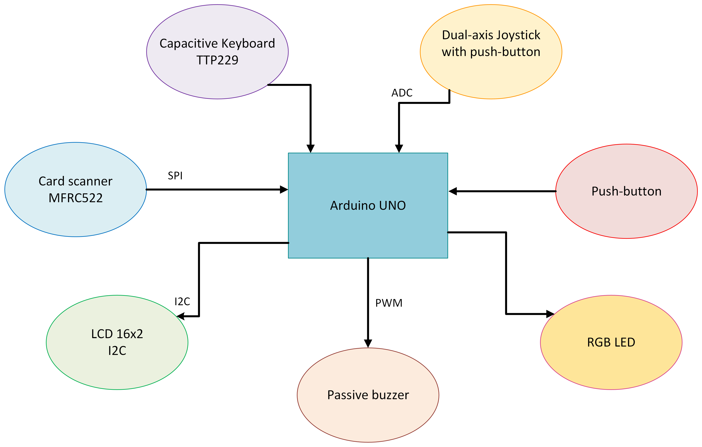
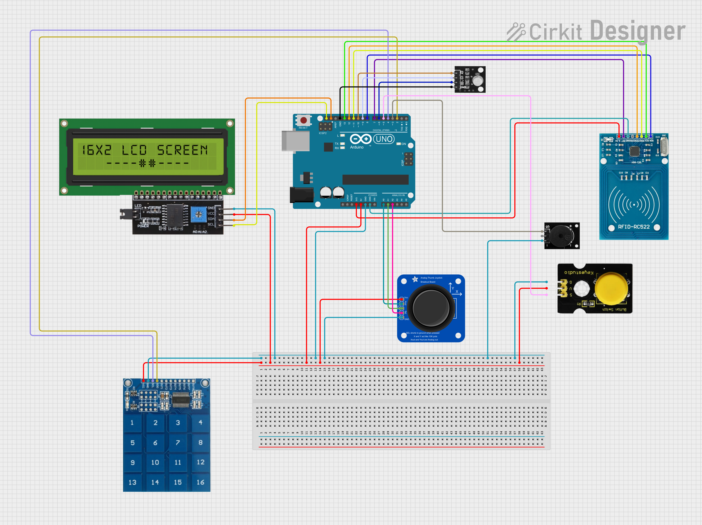
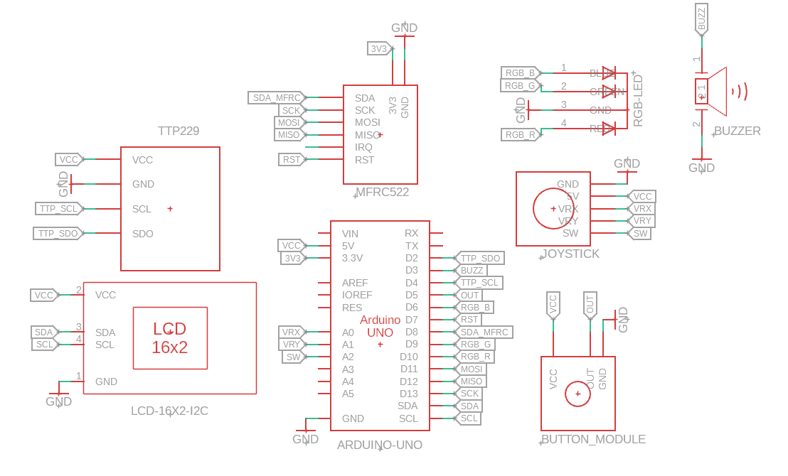
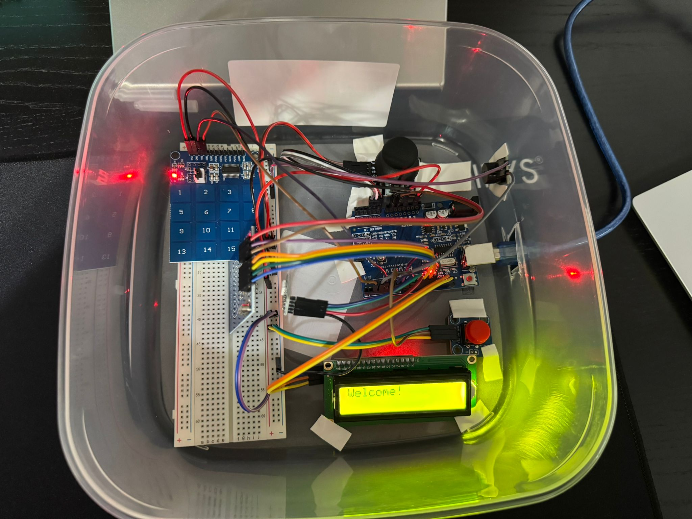
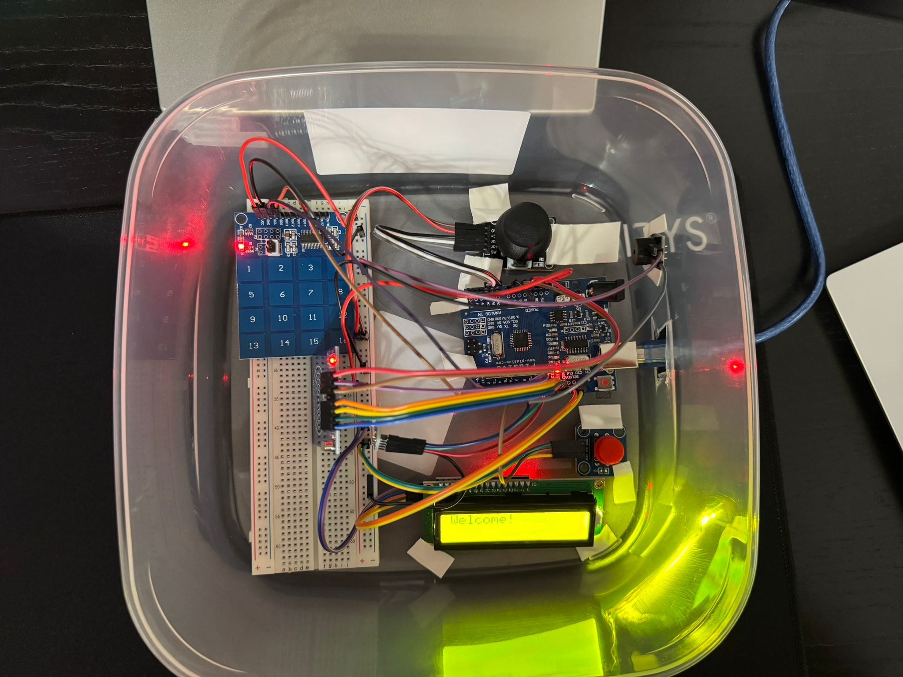
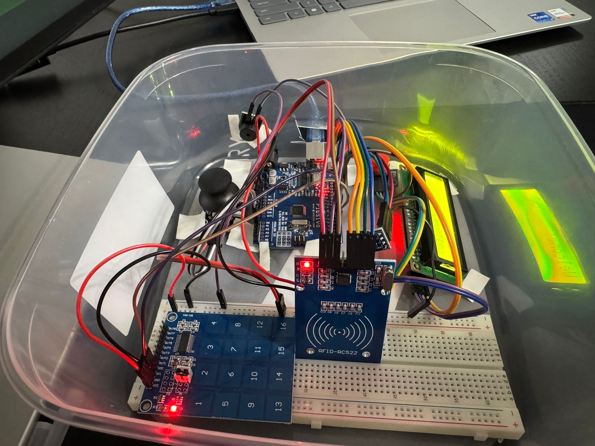
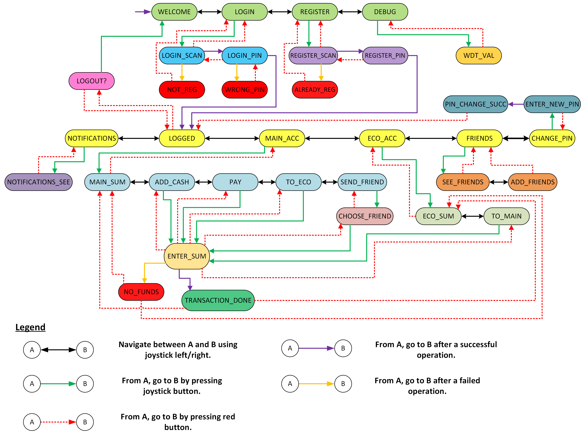

*Designed by Marius-Tudor Zaharia, 333CA, May 2025*

# BankApp

## Table of Contents
1. [Introduction](#introduction)
2. [General Description](#general-description)
    * [Block Scheme](#block-scheme)
    * [Components and Their Use](#components-and-their-use)
3. [Hardware Design](#hardware-design)
    * [Components Scheme](#components-scheme)
    * [Electrical Schematic](#electrical-schematic)
    * [Bill of Materials](#bill-of-materials)
    * [Images](#images)
4. [Functionalities](#functionalities)
    * [State Diagram](#state-diagram)
    * [Usage Guide](#usage-guide)
    * [State Flow](#state-flow)
5. [Software Design](#software-design)
    * [Background and General Details](#background-and-general-details)
    * [Implementation Details](#implementation-details)
        - [Modules](#modules)
        - [How it Works](#how-it-works)
        - [Correctness Validation](#correctness-validation)
        - [Optimizations](#optimizations)
6. [Results](#results)
7. [Conclusions](#conclusions)
8. [Bibliography](#bibliography)

---

## Introduction
**_What is BankApp?_**
- BankApp is a hardware-software product that offers various functionalities of a real-world banking application.
- The hardware is centered around a microcontroller, with multiple peripheral devices allowing for a smooth user-system interaction.
- The software is built with efficiency and simplicity in mind, assuring a pleasant experience for the user.

**_Purpose_**
- BankApp offers a hardware-software interface that empowers users with a multitude of actions:
  - register in the bank, using a personal card
  - set up a PIN code
  - access to a checking account
  - access to a savings account (with interest gain)
  - add money to the checking account
  - perform payments from the checking account
  - transfer money between checking and savings account
  - add friends
  - send money to friends
  - visualize notifications

**_Why this idea?_**
- Because banking doesn't have to be complicated and boring.
- BankApp offers a fun, yet efficient implementation to an ubiquitous need of the modern world: money management.
- With its attractive design and ease of use, BankApp is sure to steal the hearts of world-wide users.

---

## General Description

### Block Scheme

---

### Components and Their Use
- **Arduino UNO**
  - Uses an `ATMega328P` microprocessor.
  - Provides just enough memory and computational power for a small-sized, embedded project like this.
  - The "engine" of the system, controls the whole behind-the-scenes logic of the app.

- **LCD 16x2 with I2C module**
  - Communicates by `I2C` with the microcontroller.
  - The main source of information and feedback provided to the user.
  - Displays all menus and actions.

- **MFRC522 Card scanner**
  - Communicates by `SPI` with the microcontroller.
  - The user scans the card here, when prompted.

- **Dual-axis Joystick, with push-button**
  - Gets `analog` input from the user, which is then converted to `digital` data.
  - Used to navigate between menus and as an `OK/Confirm` button.
  - The push-button needs debouncing.

- **TTP229 Capacitive keyboard (16 keys)**
  - Used to input the PIN code and money sums.
  - No debouncing needed.
  - `10` is used as `0`
  - `11` is used as backspace

- **Red Push-button module**
  - Used as a `Back/Cancel` button.
  - Needs debouncing.

- **Passive buzzer module**
  - Commanded by the microcontroller via `PWM`.
  - Provides acoustic feedback to the user.

- **RGB LED module**
  - Provides visual feedback to the user.

---

## Hardware Design

### Components Scheme
Created using [Cirkit designer](https://app.cirkitdesigner.com/).  

---

### Electrical Schematic
Created using **Autodesk Fusion360**.  

---

### Bill of Materials

| Component                 | Link to Vendor       | Datasheet Link       |
|:--------------------------|:---------------------|:---------------------|
| Arduino Uno (ATmega328P)  | [Vendor Link][1]     | [Datasheet][2]       |
| Capacitive touch (TTP229) | [Vendor Link][3]     | [Datasheet][4]       |
| LCD I2C 16x2              | [Vendor Link][5]     | [Datasheet][6]       |
| Card scanner (MFRC522)    | [Vendor Link][7]     | [Datasheet][8]       |
| Dual-axis Joystick        | [Vendor Link][9]     | [Datasheet][10]      |
| Passive buzzer            | [Vendor Link][11]    | [Datasheet][12]      |
| Red Push-button module    | [Vendor Link][13]    | [Datasheet][14]      |
| RGB LED module            | [Vendor Link][15]    | [Datasheet][16]      |

[1]: https://www.optimusdigital.ro/ro/compatibile-cu-arduino-uno/1678-placa-de-dezvoltare-compatibila-cu-arduino-uno-atmega328p-i-ch340.html?search_query=arduino+uno&results=129
[2]: https://ww1.microchip.com/downloads/en/DeviceDoc/Atmel-7810-Automotive-Microcontrollers-ATmega328P_Datasheet.pdf
[3]: https://www.optimusdigital.ro/ro/senzori-senzori-de-atingere/1112-modul-senzor-de-atingere-capacitiv-ttp229.html?search_query=ttp229&results=1
[4]: https://www.elecrow.com/download/TOUCH_IC_TTP229.pdf?srsltid=AfmBOoqo7Ke-s70MrGPNH8ybwpKkbP1e0YHdyJJ1cgY-pO7H9_JEeV1g
[5]: https://www.optimusdigital.ro/ro/optoelectronice-lcd-uri/867-modul-lcd-1602-cu-backlight-galben-verde-de-5v.html?search_query=lcd&results=217
[6]: https://www.handsontec.com/dataspecs/module/I2C_1602_LCD.pdf
[7]: https://www.optimusdigital.ro/ro/wireless-rfid/67-modul-cititor-rfid-mfrc522.html?search_query=rfid&results=37
[8]: https://www.nxp.com/docs/en/data-sheet/MFRC522.pdf
[9]: https://www.optimusdigital.ro/ro/senzori-senzori-de-atingere/742-modul-joystick-ps2-biaxial-negru-cu-5-pini.html?search_query=joystick&results=40
[10]: https://naylampmechatronics.com/img/cms/Datasheets/000036%20-%20datasheet%20KY-023-Joy-IT.pdf
[11]: https://www.optimusdigital.ro/ro/componente-electronice/12598-modul-buzzer-pasiv.html?search_query=buzzer&results=62
[12]: https://www.mouser.com/datasheet/2/400/ef532_ps-13444.pdf?srsltid=AfmBOoqbsSJwSZTEsRwIMRXFPSzOyIAoX16I4LJVPdoIQMhGQaXOO7sl
[13]: https://www.optimusdigital.ro/ro/butoane-i-comutatoare/2375-modul-cu-buton-rou.html?search_query=buton&results=212
[14]: https://roking.rs/download/manuals/Catalog-Pushbutton-Switch.pdf
[15]: https://www.optimusdigital.ro/ro/optoelectronice-led-uri/737-modul-cu-led-rgb.html?search_query=led+rgb&results=108
[16]: https://asset.conrad.com/media10/add/160267/c1/-/en/001616253ML01/upute-za-rukovanje-1616253-iduino-se010-rgb-led-modul-1-st.pdf

### Images

---

## Functionalities

### State Diagram

**Notes:**
- The `LOGOUT` menu can be reached by pressing the `red button` from any menu of the `LOGGED IN` state (i.e. the yellow menus).
- The `NOTIFICATIONS_SEE`, `SEE_FRIENDS` and `ADD_FRIENDS` menus offer interfaces where the user can navigate between entries.

---

### Usage Guide

#### General Commands
- Navigation between menus is done by flicking the joystick to the left/right.
- A click on the joystick button is used for selecting a menu or confirming an action.
- A click on the red button is used for cancelling the current action or returning to the previous menu.
- The keyboard does not have a `0` key, so `10` is used as a `0`, while `11` is used as backspace.
- To accept a friend request, the joystick should be flicked up.
- To reject a friend request, the joystick should be flicked down.
- As a welcome bonus, each user starts with 200 in the checking account and 100 in the savings account.
- Buzzer sounds and LED lights accompany the LCD messages as feedback at each step.

---

#### State Flow
**Start menu**
- The device starts with the `Welcome` menu. By flicking the joystick to the left/right, the user can navigate between menus and choose the next action, `Login` or `Register`, by clicking the joystick button. A `Debug` menu is also available.

**Register menu**
- To `register`, a card should be placed next to the card reader, and then a 4-digit PIN code is required. If the user is already registered, an error message is displayed, else, the user's home menu is accessed.

**Login menu**
- To `login`, the same steps as for `register` should be followed, with the exception that the validity of the PIN code is checked. Also, if the user has not previously registered, an error message is displayed.

**Logged-in menu**
- After a successful log-in, the user has access to multiple menus, beginning with the `Hello` menu.
- To the right, the following menus are available: `Main account`, `Economies account`, `Friends`, `Change PIN`.
- To the left, the `Notifications` menu can be found.
- From any of these menus, if the red button is pressed, the `Logout` menu is accessed, where the user is asked to confirm the logout.

**Main account menu**
- The user can see the sum available in his checking account. From here, he can `add cash`, `make a payment`, `transfer money to the economies account` and `send money to a friend`.
- For each of these actions, a menu asking for the sum shall be accessed. The number must be at most 7-digits long. For each transfer from the account (thus, excluding `add cash`), the existing sum is first checked. If the balance is insufficient, an error message is displayed, and the transaction is aborted.

**Economies account menu**
- The user can see the sum available in his savings account. Every 15 seconds, a 2% interest is added to this sum.
- The user can `transfer money to the main account`, in a similar way as described above.

**Friends menu**
- The user can access the `See friends` and the `Add friends` menus.
- If he already sent a friend request to a certain user, or if that user sent a friend request to the current user that has not yet been resolved, the current user cannot send another friend request to that user.

**Notifications menu**
- There are 3 types of notifications supported: `Friend request`, `Accepted friend request`, `Received money from friend`.
- The latter 2 can be marked as seen by clicking the joystick button.
- For friend requests, the joystick should be flicked up/down to accept/reject it.

---

## Software Design

### Background and General Details
- The project was developed using the **PlatformIO** extension for VSCode.
- The following **external libraries** were used:
  - `Arduino.h` - from PlatformIO  
    Contains macro-definitions for Arduino pins and basic functions such as `pinMode()` or `tone()`.
  - `LiquidCrystal_I2C.h` - [GitHub](https://github.com/johnrickman/LiquidCrystal_I2C)  
    Used for interfacing the LCD, using the I2C protocol. Provides the `LiquidCrystal_I2C` class, which offers methods for initialization, cursor placing and writing characters.
  - `MFRC522.h` - [GitHub](https://github.com/miguelbalboa/rfid)  
    Used for interfacing the RFID card scanner, using the SPI protocol. Provides the `MFRC522` class, which offers methods for initialization, card detection and UID reading.
  - `TTP229.h` - [GitHub](https://github.com/optimusdigital/ttp229-arduino)  
    Used for interfacing the TTP229 capacitive keyboard. Provides the `TTP229` class, which offers a non-blocking method for key reading.
- **Novelty elements** - a banking device that uses a joystick as primary navigation method, adding the fun element to the sobriety of a financial app.
- **Laboratories functionalities used**
  - **Lab 0 - GPIO**: The RGB LED is connected to 3 digital GPIO pins of the Arduino, which are set as output.
  - **Lab 2 - Interrupts**: The Watchdog Timer is programmed to generate an interrupt every second (to manage the interest gain times for the savings accounts).
  - **Lab 3 - PWM**: The passive buzzer is controlled using the `tone()` function, which uses PWM behind the scenes.
  - **Lab 4 - ADC**: The Arduino reads analog values from the Joystick - `analogRead(JOYSTICK_VRX_PIN)`.
  - **Lab 5 - SPI**: The Arduino communicates by SPI with the RFID card scanner.
  - **Lab 6 - I2C**: The Arduino communicates by I2C with the LCD.

---

### Implementation Details

#### Modules
**pins**
- Contains the mappings between Arduino pins and peripheral components pins.

**sounds**
- Contains various sounds for the buzzer, used as audio feedback for the user after certain actions.

**lights**
- Contains multiple color schemes for the RGB LED, used as visual indicators of the menus the user is navigating.

**wdt_counter**
- Controls the Watchdog Timer, by setting it up to generate an interrupt every second.
- It is used as a time-keeper for managing the interest gain of the savings accounts (every 15 seconds, interest is applied).
- It is preferred instead of Timer0/1/2, because these might be controlled by the `millis()` function, which is also used in the project.
- If, at a later time, another configuration of the WDT might be preferred (i.e. interrupt after a time interval), only this module is to be modified, without interfering with other sections that use timers.
- The source file contains a static variable (private to the file) that represents the counter, offering an init and a getter method for outside modules.
- The ISR is rather short and simple, by only incrementing the counter value.
- The live value of the counter can be observed in the debug menu.

**debounce**
- Offers methods for checking if the joystick is flicked to the right/left/up/down, if the joystick button is pressed and if the red button is pressed.
- In the source file, multiple static variables for debounce handling are used, which must not be accessible from the outside.
- For button debouncing, a generic function is implemented, which is used by specific functions for the two buttons.
- For joystick flicks checking, it is verified if a certain time has passed since the last registered flick, such that there is a delay in the menu navigation system (i.e. the menus do not fall through instantly).

**utils**
- Contains utility data structures, constants, global variables marked as `extern` and various helper functions.
- The `User` structure is declared here, containing the necessary information each user must possess.
- Functions for keyboard reading, user management, UID card reading and notification handling are specified here.

**menus**
- The enum class that encodes the menus and the functionality of each menu are described here.

**main**
- Initializes the global variables, the user database and all the peripheral devices.
- Contains the main loop, which presents the `switch` statement by which the current menu function is chosen

---

#### How it Works
- The users are stored in a statically allocated array, each of them having a predefined name and UID. Initially, all of them are marked as not registered and have to go through the `register` menu to become active.
- The `main loop` is rather simple: at each iteration, it checks the value of the `curr_menu` global variable via a `switch` and launches the associated routine accordingly. Each such routine then displays its message and enters a `while(true)` loop, waiting for user input.
- The goal was to develop a device as realistic and error-less as possible, so extreme cases are always considered, such that: the user is forced to enter a 4-digit PIN code (is not allowed to submit it until it has 4 digits and cannot input more than 4 digits), the user is always allowed to cancel his current action if he changes his mind, hypothetical error states are checked, sending the system to the `ERROR` menu if such a case occurs (i.e. if the current menu is the home page of a user, but there is no user logged in).
- `enum class` have been used for their own namespace feature and for their expressivity compared to numerical constants.

---

#### Correctness Validation
- Each component was firstly tested alone to validate that the hardware was functional.
- The system as a whole was incrementally tested, after each new feature added.

---

#### Optimizations
- Because the maximum number of users is 6, their `registered` status was saved as a single 8-bit variable, using bitwise operations: user i is registered if the i-th bit (from the right) of the variable is 1. If each user had a boolean variable associated for this matter, 6 bytes would have been used in total, instead of 1. Thus, 5 bytes are saved.
- As the available RAM memory is limited, all the menu message strings were stored on the Flash rather than the RAM, via the `F()` macro. Also, variable types from `<stdint.h>` were used, for a better control.
- The notifications are encoded for memory efficiency: the `Notification` struct contains the type (`RecvFromFriend`, `FriendReq`, `ReqAccepted`), the index of the user who sent it and the sum of money sent (used when it is the case).

---

## Results
- The final result is a fully functional, robust device, that encompasses all the proposed features in an intuitive and efficient way, both hardware and software wise.
- [Demo on YouTube](https://youtu.be/4Y1_n8hq_Kc)

---

## Conclusions
- To sum up, this project achieved its goal of getting hands-on experience with embedded design, from wiring up the components all the way to writing efficient and functional software.
- For me, it was a fun experience with satisfactory results, which I will surely cherish in the future!

## Bibliography

- [MFRC522 setup](https://randomnerdtutorials.com/security-access-using-mfrc522-rfid-reader-with-arduino/)
- [Joystick setup](https://arduinogetstarted.com/tutorials/arduino-joystick)
- [TTP229 setup](https://forum.arduino.cc/t/configure-ttp229-capacitive-touch-keypad/1094055)
- [LCD setup](https://lastminuteengineers.com/i2c-lcd-arduino-tutorial/)
- [ATmega328P Datasheet](https://ww1.microchip.com/downloads/en/DeviceDoc/Atmel-7810-Automotive-Microcontrollers-ATmega328P_Datasheet.pdf)
- [Button debouncing](https://docs.arduino.cc/built-in-examples/digital/Debounce/)
- [Watchdog timer setup](https://forum.arduino.cc/t/watchdog-timer-interrupt-mode-related-question/1087738)
- [C++ enum class](https://www.geeksforgeeks.org/enumeration-in-cpp/)
